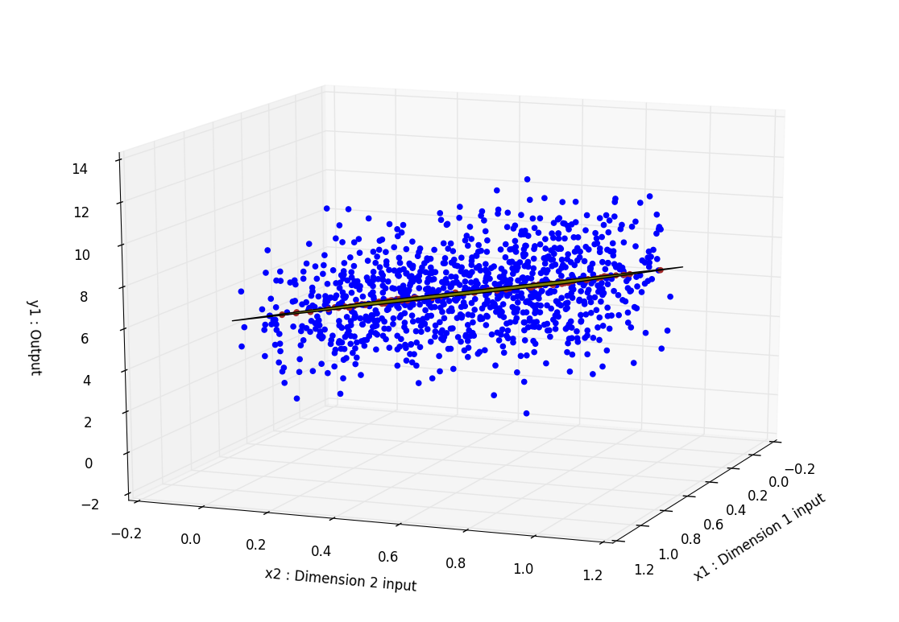
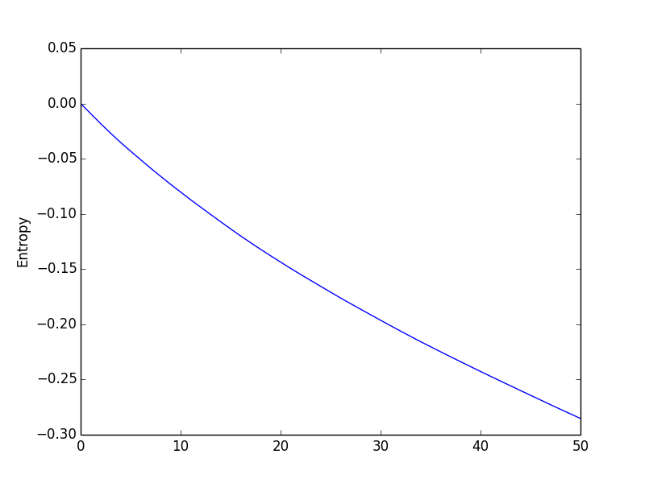
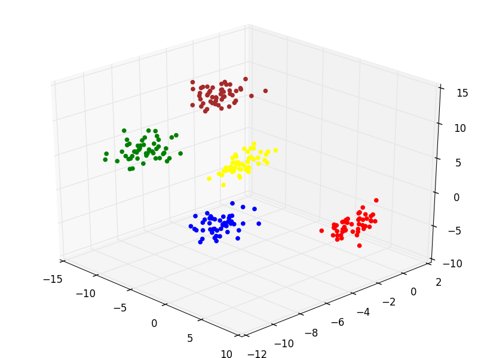
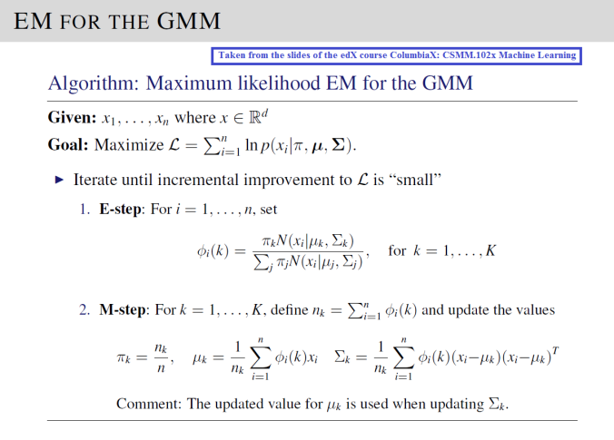
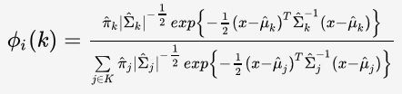

## Machine Learning Online Course from **Columbia University**

Here is a repo where you can find my work on several machine learning algorithms implementation in Python.

You would need :

-   [Numpy](https://scipy.org/install.html)
-   [Matplotlib](http://matplotlib.org/users/installing.html)

to run my code.

## Ridge Regression and Active Learning (Project 1)

1.  Ridge Regression

**Problem:** In this part I implement a ridge regression algorithm (ℓ2-regularized least squares linear regression). By maximizing the objective function I find the unknown parameters wRR.

**Solution:** The parameters wRR are calculated that way:

Once wRR is learned from the training data (X, Y), I predict the output Y from a test sample using :

I obtain this graph where the input data is in blue, the predicted output from test data is in red. What seems to be a green line is a plane cutting through the space. We can see that each predicted output are superposed with this plane as it is plotted using the learned parameters wRR. Here the dimension of the input data is only 2 to create a meaningful plot but obviously it can be extended to any dimension.

The weights weights wRR are exported to the `wRR_[lambda].csv` file.

2.  Active Learning

**Problem:** Active Learning (effectively Bayesian Learning) is often used is the case of sequential data. There are situations in which unlabeled data is abundant but manually labeling is expensive. Since the learner/algorithm chooses the data points, the number of them to learn a concept can often be much lower than the number required in normal supervised learning.
If we let X and y be the data we already learned from and y0 and x0 be some new data, by Bayes rule we have :

I want to learn the new parameters w from the new data and the old one to make predictions for new y0. The posterior distribution we learned from (y,X) becomes the prior distribution for (y0, x0).

**Solution:** From the measured dataset (y,X) I learn the posterior distribution p(w|y, X). I can then construct the predictive distribution for every remaining x0 ∈ D:

Then I do the following steps iteratively :
1.  Form predictive distribution p(y0|x0, y, X) for all unmeasured x0 ∈ D.
2.  Pick the x0 for which sigma0^2 (measuring how confident we are) is largest and measure y0. This is indeed the measure that is predicted to be the furthest off what our correct output should be.
3.  Update the posterior p(w|y, X) where now y and X take into consideration the last measured data (y0, x0).

A way to test my algorithm is to feed him with labelled data `X_train.csv` and `y_train.csv` to train the weights w and then some test data `X_test.csv` to see whether it choose the right data points to learn from.

**Verification:** One way to verify that my Active Learning algorithm if indeed picking up the right data points and is learning efficiently is by calculating the differential entropy between each steps. As the entropy is the measure of the spread of the distribution, the smaller it gets the more our distribution becomes certain/precise (meaning a smaller variance). Using a rank-one update property of the determinant, the entropy of the prior Hprior is related to the entropy of the posterior Hpost as follows:

And we obtain such a result after iterating over 50 data points:

The way to execute these 2 algorithms is by executing :

`python hw1_regression.py <lambda> <sigma2> X_train.csv y_train.csv X_test.csv`

The first 10 data points it chooses to learn are exported to the `active_[lambda]\_[sigma2].csv` file.

## Bayes Classifier (Project 2)

...

## K-Means & Gaussian Mixture Models (Project 3)

The idea here is that our input data points are in a X.csv file. There are no missing values.

1.  K-Means algorithms

**Problem:** I try to find K centroids  {μ1,…,μK}  and the corresponding assignments of each data point  {c1,…,cn}   where each  ci∈{1,…,K}   and c_i indicates which of the K clusters the observation x_i belongs to. The objective function that needs to be minimized can be written as

**Solution:** First, I generated randomly K centroids. I wasn't very happy with my results so I looked for a better initialization of the centroids and I've found the K-means++ algorithm. The implementation is the following :

I choose the first centroid randomly. Then, iteratively I calculate the distance D from every point to that centroid. I then choose the next centroid with a probability weighted by the distance D squared. This effectively increases the probability to end up with centroids far from each other. The further each initial centroids are, the higher the probability to end up with true clusters in the end.

I then successively iterate through the following steps:

Expectation Step : I assign each data entry to the closest centroid. Closest meaning here the squared Euclidian distance.

Maximization Step : I update the mean of each centroids by computing the empirical average of each data points.

By successively executing the Expectation and Maximization steps of the EM algorithm, I calculate the K centroids and assign each data points to one of them.
The output is the centroids-[iteration].csv files.

We can see on the picture that each color represents one cluster.

2.  Maximum Likelihood EM for the Gaussian Mixture Model (GMM)

**Problem:** Now the data is generated as follows :

In other words, the ith observation is first assigned to one of K clusters according to the probabilities in vector π, and the value of observation xi is then generated from one of K multivariate Gaussian distributions, using the mean and covariance indexed by ci.
I treat the cluster assignments of each data point as the auxiliary data (missing data of the EM algorithm).

**Solution:** Here is the solution I implemented.

Phi for a certain data point would be the probabilities to belong to each cluster. Its sum is 1. It really shows here the soft clustering dimension of the GMM algorithm. I use the plug-in classifier to evaluate this function further detailed here.

The initialization of π, mu and sigma are really impacting the efficiency of the solution. The way I did is using the results from the previous K-means++ algorithm.
